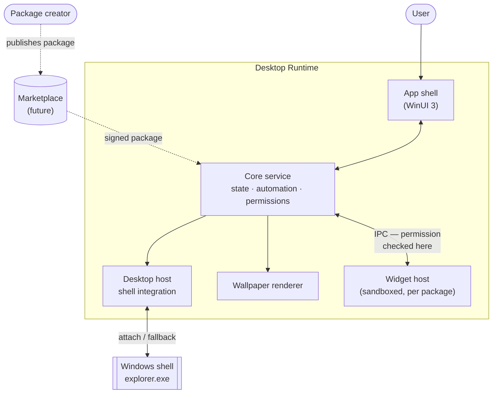
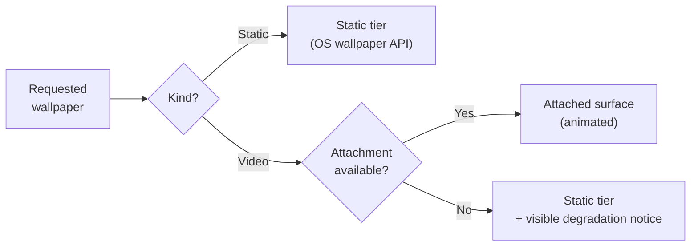
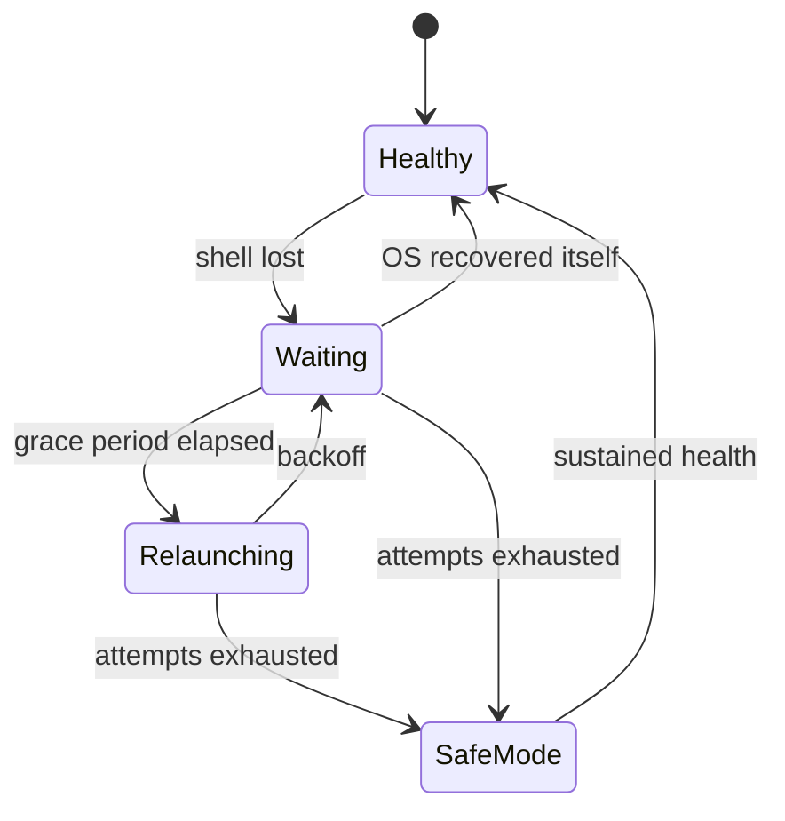

# System Context

Orientation document: what the pieces are, how they relate, and which of them exist yet. Detail lives in the linked documents.

## Context

## Trust boundaries

Everything inside the product is our code **except the widget host**, which runs package-authored code and is sandboxed accordingly. The critical rule from [ADR-0004](adr/0004-process-and-isolation-model.md): permission checks happen in the core service, never in the sandboxed process. A compromised widget host may issue any request and still gain nothing it was not granted.

## Wallpaper rendering path

Per [ADR-0003](adr/0003-desktop-hosting-strategy.md), animated wallpaper is **opportunistic, not guaranteed** — Phase 3 found behind-icon rendering is not reliably achievable on current Windows 11 builds. Static content uses the static tier even when attachment is available, since a still image should not consume a scarce, fragile surface.

## Shell recovery

The transition out of `SafeMode` requires *sustained* health, not mere reappearance — see [recovery-model.md](recovery-model.md) for why that distinction is the whole design.

## What exists

| Area | Status |
|---|---|
| Workspace schema, permission model, widget manifest, automation schema, wallpaper tiers, recovery policy, resource accounting, package format | **Implemented and tested** (`src/DesktopRuntime.Core/`) |
| Process/isolation model | Designed ([ADR-0004](adr/0004-process-and-isolation-model.md)), **not built or validated** |
| App shell, core service, desktop host, wallpaper renderer, widget host | **Not built** — no UI or running processes yet |
| Marketplace | Not started (Phase 8) |

Everything implemented so far is pure policy: no I/O, no clock reads, no OS calls. That is why it is thoroughly testable, and equally why none of it has yet been exercised against a running system. The Phase 3 prototypes in `prototypes/` are the only code that has touched the real desktop, and they are throwaway.

## Reading order

1. [`../product/prd.md`](../product/prd.md) — what is being built and for whom
2. [`adr/0003-desktop-hosting-strategy.md`](adr/0003-desktop-hosting-strategy.md) — the finding that shaped everything else
3. [`adr/0004-process-and-isolation-model.md`](adr/0004-process-and-isolation-model.md) — how isolation is meant to work
4. [`permission-model.md`](permission-model.md) → [`widget-manifest.md`](widget-manifest.md) → [`package-format.md`](package-format.md) — the trust chain, outermost last
5. [`workspace-schema.md`](workspace-schema.md), [`automation-schema.md`](automation-schema.md), [`recovery-model.md`](recovery-model.md), [`resource-accounting.md`](resource-accounting.md)
